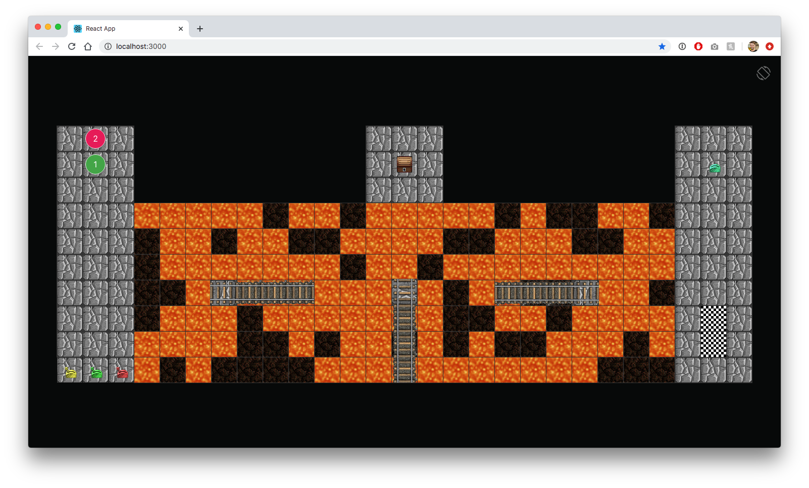

# React D&D Puzzle Game

A puzzle for a remote Dungeons & Dragons game, written in React.



## Installation

Install the dependencies with:

```
npm install
```

## Start the app

Start the local webserver with:

```
npm start
```

Open you favorite web browser and navigate to [http://localhost:3000](http://localhost:3000).

## About the Game

Deep within the forgotten dwarven mines your party encounters a large gorge, carved out by an active lava flow. You notice what appears to be a half-completed railroad bridge, and a series of levers. You must find a way to cross this dangerous gorge in order to continue your quest.

### Objective

Both player tokens must safely move to the otherside of the gorge, without falling into the lava. You win when **both** player tokens are moved onto the "finish" tiles (checkboard pattern).

### Controls

- Player tokens are moved with drag & drop.
- You can only interact with an item (leaver, chest) when you have a player token standing next to it (ie: on an adjacent square).


## Limitiations / TODO

Due to time constraints the current implementation has the following limitiations:

- There is nothing preventing you from dragging the player tokens immediately across to the "finish" tiles. But that kind of defeats the point of playing... so just don't do that 😉.


- The lava doesn't actually "kill" you, or trigger a lose condition (I ran out of time). But hey, this is for a D&D game, imagine that it does and reload the page if you mess up 🙂.

- There is not "multiplayer" support. Originally this was designed to be run in a remote D&D game, where the GM would be sharing their screen and in control of the tokens.

---

This project was created by Matt Fairbrass.
Bootstrapped with [Create React App](https://github.com/facebook/create-react-app).
